# Ensemble leanring ANN tensorflow log

## 30 May

Have tried to construct a small ANN using the architecture as follow:


```text
Model: "sequential"
_________________________________________________________________
 Layer (type)                Output Shape              Param #   
=================================================================
 flatten (Flatten)           (None, 1023)              0         
                                                                 
 dense (Dense)               (None, 40)                40960     
                                                                 
 dense_1 (Dense)             (None, 18)                738       
                                                                 
=================================================================
Total params: 41,698
Trainable params: 41,698
Non-trainable params: 0
_________________________________________________________________
```

--------------------------------------------------------------------
Piece of the code and settings:

    batch_size = 100

    optimizer=keras.optimizers.Adam(learning_rate=0.001, beta_1=0.9, beta_2=0.999)

    callbacks=[keras.callbacks.EarlyStopping(patience=5)]
--------------------------------------------------------------------

accuracy keeps being below 30%

with the earlystopping callback of patience of 5


## 31 May

Will have to try to use numpy type as input instead of using dataset type from tensorflow.

Added new HeNorm initializer to each layer, this does not help with the loss and accuracy.


Will try 1 cycle schedule and see what is the best learning rate


## 1 June

Have tried the 1 cycle schedule to try to find the best learning rate, however, it seems that it stil did not solve the problem with 

high loss and not converging. And also after checking, most of the weight has been reduced to almost 0 (really low value). 

Thought it might be the issue with regularization, have tried to drop out the regularization.


## 3 June

Still no improvement when training without regularization, suspect that the dataset and label has been messed up, will try to start with simple numpy array and corresponding label.

Simply use train_test_split to give a Train set and test set, and add another argument as validation_split=0.15/(0.15+0.70), cancel the flatten layer at the same time.

If this does not work, then I will start writing my own preprocessing stage instead of using the precalculated dataset.

Or I will export the mat data to csv.


**Update: Rewrtiting the model and cut off the input flatten layer helped with the training process, now thinking probably the l2 reugularization rate of 0.01 might be too high.** 


--------------------------------------------------------------------
Piece of the code and settings:

    callbacks=[keras.callbacks.EarlyStopping(patience=50)
--------------------------------------------------------------------


### updated model summary

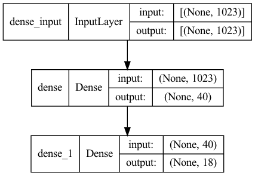

```text
Model: "sequential"
_________________________________________________________________
 Layer (type)                Output Shape              Param #   
=================================================================
 dense (Dense)               (None, 40)                40960     
                                                                 
 dense_1 (Dense)             (None, 18)                738       
                                                                 
=================================================================
Total params: 41,698
Trainable params: 41,698
Non-trainable params: 0
_________________________________________________________________
```

Changing the regularization rate to 0.001, the performance was great but it would overfit.


--------------------------------------------------------------------
final training result:

    Epoch 153/400
    197/197 [==============================] - 1s 7ms/step - loss: 0.8879 - accuracy: 0.9774 - val_loss: 1.3972 - val_accuracy: 0.7436
--------------------------------------------------------------------


## 4 June


Changing the regularization rate to 0.005, there is a bit performance drop, but at the same time, the overfit is getting slightly better.


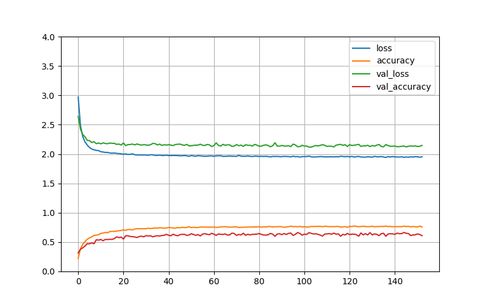


Just realised that I have not let the model evaluate the test set from the first training. Will add that up later.

--------------------------------------------------------------------
final training result:

    Epoch 145/400
    197/197 [==============================] - 1s 7ms/step - loss: 1.9614 - accuracy: 0.7593 - val_loss: 2.1619 - val_accuracy: 0.6275
    43/43 [==============================] - 0s 6ms/step - loss: 2.1735 - accuracy: 0.6222
--------------------------------------------------------------------


It seems that the validation accuracy is just 63%, more or less the same with the test accuracy, the regularization helpped shrink the gap between
training and test from 21% to 14%, seems there should be improvment that could be done.


## 5 June

It seems the previous model with the l2 rete at 0.001 did a better job with the performance.

It could also be concluded that hte validation accuracy would match the test accuracy in most cases.

--------------------------------------------------------------------
Evaluation result form the previous model:

    43/43 [==============================] - 0s 5ms/step - loss: 1.3979 - accuracy: 0.7459
    Out[13]: [1.397900938987732, 0.7459259033203125]
--------------------------------------------------------------------


Will try to drop the regularization and have another full on go to see how that goes.


### result without regularization

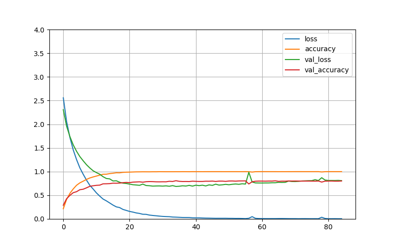


--------------------------------------------------------------------
Evaluation result for no regularization model:

    Epoch 85/400
    197/197 [==============================] - 1s 7ms/step - loss: 0.0044 - accuracy: 0.9987 - val_loss: 0.8088 - val_accuracy: 0.8017
    43/43 [==============================] - 0s 5ms/step - loss: 0.8663 - accuracy: 0.7963
--------------------------------------------------------------------


It seems that the model without regularization performed well enough, even though the gap between the trainning and validation accuracy 
was about 20%.


Will try to use a customized Adam optimizer to do this model again.


### result with self customized Adam optimizer

`optimizer=keras.optimizers.Adam(learning_rate=0.001, beta_1=0.9, beta_2=0.999)`

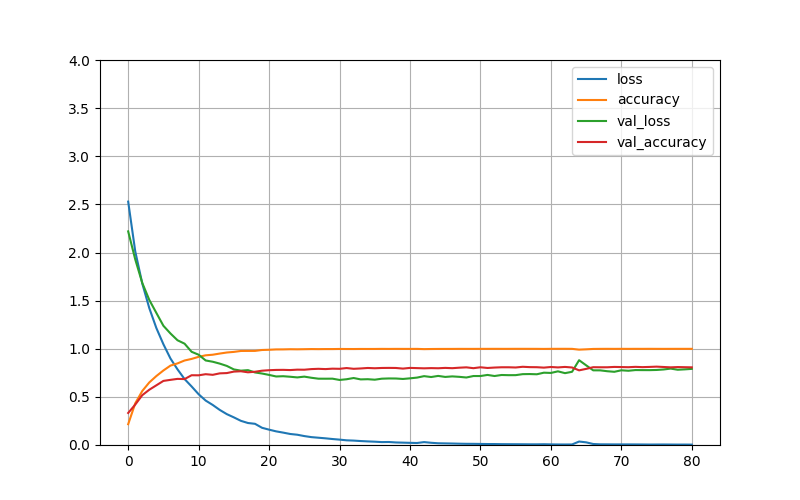

--------------------------------------------------------------------
    Epoch 81/400
    197/197 [==============================] - 1s 7ms/step - loss: 0.0039 - accuracy: 0.9990 - val_loss: 0.7909 - val_accuracy: 0.8068
    43/43 [==============================] - 0s 5ms/step - loss: 0.8421 - accuracy: 0.8000
--------------------------------------------------------------------

This result looks teeny_tiny slightly better than the previous model with default Adam optimizer. however, the accuracy keeps staying at 80%.

It has also been spotted that the loss for the validation keeps dropping until one point it started to rise up again, however, the accuracy seems quite stable.

Will try to use Relu instead of sigmoid for the hidden layer's activation function.


### result with relu activation function


--------------------------------------------------------------------
    model = keras.Sequential([
        keras.layers.Dense(40, activation='relu', kernel_initializer=initalizer),        
        keras.layers.Dense(18, activation='softmax', kernel_initializer=initalizer)
    ])
--------------------------------------------------------------------


It seems that relu was not as good as sigmoid in terms of performance and training stability.

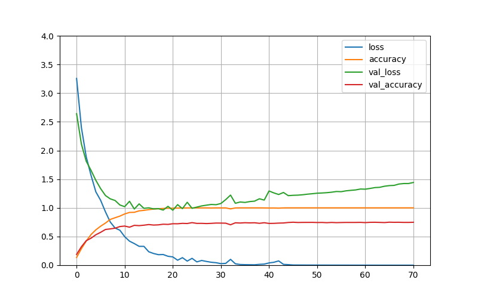


--------------------------------------------------------------------
    Epoch 71/400
    197/197 [==============================] - 1s 7ms/step - loss: 4.1040e-04 - accuracy: 1.0000 - val_loss: 1.4422 - val_accuracy: 0.7487
    43/43 [==============================] - 0s 5ms/step - loss: 1.3895 - accuracy: 0.7607
--------------------------------------------------------------------


However, the loss of the training could go as low as the magnitude of $$4e^{-4}$$.

Will switch back to sigmoid and add another feature of saving the best parameters while the validation loss is at its lowest.


### Small study on the model on matlab

The loss graph on matlab could be observed:

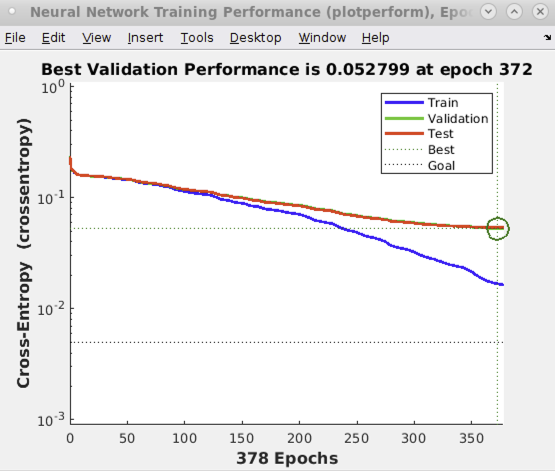

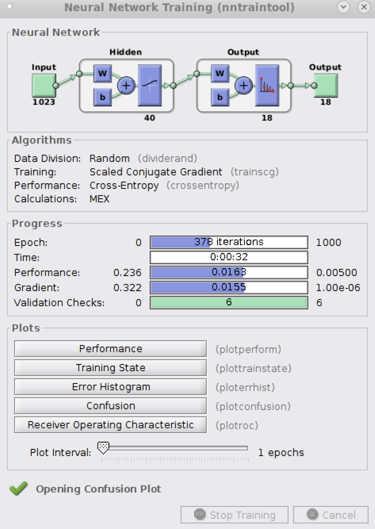

The test run on this network is not perfect, the accuracy on this one is not as high as 90%, it is actually 86%

--------------------------------------------------------------------
    ans =

    0.8667
--------------------------------------------------------------------


## 6 June

### Adding dropout in the training layer


Since the accuracy from the model of matlab could be as high as 86.7%, there should be something that could be done to imporove the accuracy on the model we have right now.

Since the training accuracy could be as high as 99.9%, and that would leave a gap of 20% to the validation. This has left us with the 
thought of more regularization to narrow this gap. 

Now with the attempt to add two dropout layers during training as below:


--------------------------------------------------------------------
    model = keras.Sequential([
        keras.layers.Dropout(rate=0.2),
        keras.layers.Dense(40, activation='sigmoid', kernel_initializer=initalizer),
        keras.layers.Dropout(rate=0.2),
        keras.layers.Dense(18, activation='softmax', kernel_initializer=initalizer)
    ])
--------------------------------------------------------------------


This has come to give a fairly good training result to push the validation accuracy above 84%, really close to the matlab golden model.

--------------------------------------------------------------------
    Epoch 389/400
    63/63 [==============================] - 0s 7ms/step - loss: 0.1545 - accuracy: 0.9519 - val_loss: 0.5593 - val_accuracy: 0.8424
    43/43 [==============================] - 0s 5ms/step - loss: 0.5630 - accuracy: 0.8422
--------------------------------------------------------------------


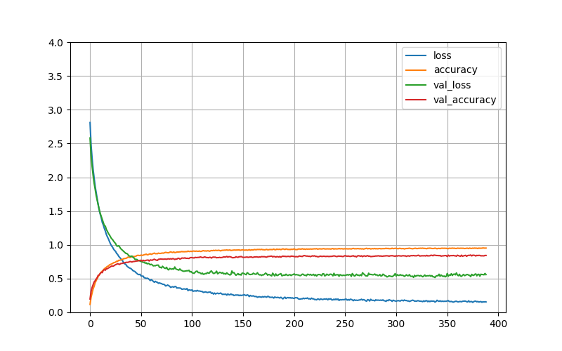

This model has been saved in the project in the path:

`Ensemble_rewrite/CheckPointPath/my_best_model_single_nn_6_June.h5`


## 9 June

**Dropout rate = 0.1**

Since the dropout layer has been working quite well on this regularization, a bit of playing around on the dropout rate shall be performed.

Will change the dropout rate to 0.1 and see how that would.

With the early stopping implemented with the patience of 50. The training stopped at 169 epochs with the accuracy slightly lower 81.6%

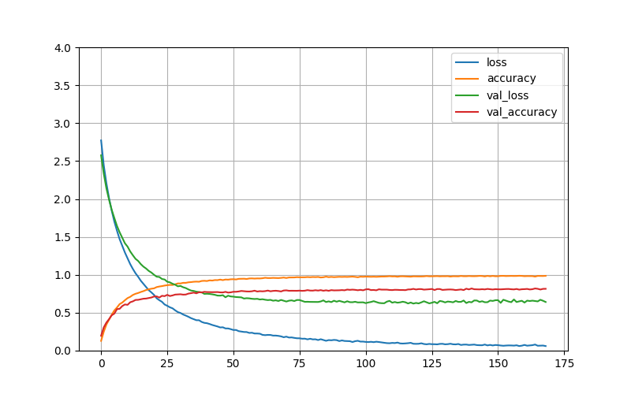

--------------------------------------------------------------------
    Epoch 169/400
    63/63 [==============================] - 0s 8ms/step - loss: 0.0606 - accuracy: 0.9868 - val_loss: 0.6417 - val_accuracy: 0.8155
    43/43 [==============================] - 0s 5ms/step - loss: 0.6883 - accuracy: 0.8193
--------------------------------------------------------------------

However, the accuracy on the training keeps being high of around 98.7%. 

It seems that the dropout will shrink the gap between trainng and validation. Will try stronger dropout rate.


**Dropout rate = 0.3**


Change the dropout rate to 0.3 to see how training will perform.

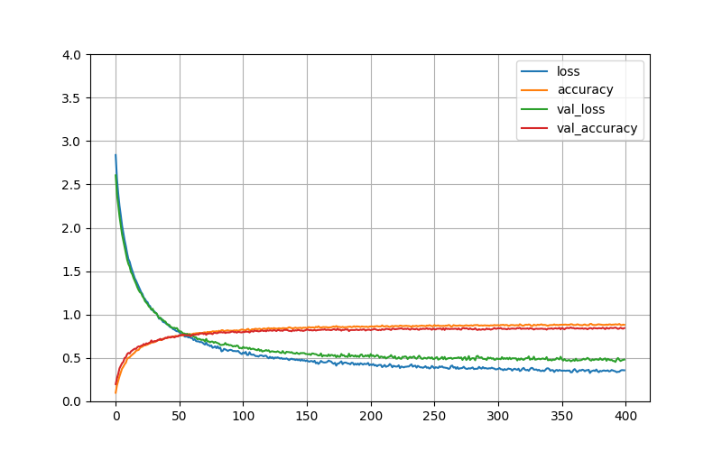

--------------------------------------------------------------------
    Epoch 400/400
    63/63 [==============================] - 0s 7ms/step - loss: 0.3582 - accuracy: 0.8817 - val_loss: 0.4820 - val_accuracy: 0.8446
    43/43 [==============================] - 0s 5ms/step - loss: 0.4955 - accuracy: 0.8422
--------------------------------------------------------------------

From what it seems, the training only stopped here because it runs out of epochs. The training and validation accuracy are getting really close.

Will give it 1000 epochs to see when it will stop and how that will turn out.


>**LONGER RUNS**

The training stopped with the accuracy of 89.2% and 85.7% for training and validation.

A slight boost from previous best model.

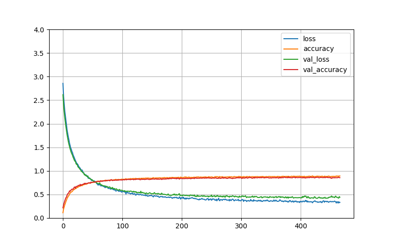

--------------------------------------------------------------------
    Epoch 467/1000
    63/63 [==============================] - 0s 7ms/step - loss: 0.3322 - accuracy: 0.8926 - val_loss: 0.4409 - val_accuracy: 0.8569
    43/43 [==============================] - 0s 5ms/step - loss: 0.4552 - accuracy: 0.8556
--------------------------------------------------------------------

This looks promising, would try a value in between 0.2 and 0.3 to see how it does, assumption here is that val_loss will be slightly worse than 0.3 but slightly better than 0.2 and gap of train and val will be lying in between 0.2 and 0.3.

At the same time, this model has been saved as "my_best_model_single_nn_9_June.h5"


**Dropout rate = 0.25**

Change the dropout rate to 0.25 to see about the performance.


--------------------------------------------------------------------
    Epoch 317/1000
    63/63 [==============================] - 0s 7ms/step - loss: 0.2395 - accuracy: 0.9224 - val_loss: 0.4896 - val_accuracy: 0.8577
    43/43 [==============================] - 0s 5ms/step - loss: 0.5016 - accuracy: 0.8541
--------------------------------------------------------------------

Think this model is overall as nearly good as the last one, but this model has a bigger gap and shorter training period.

The tradeoff prefenrece is leaning towards the dropout rate of 0.25.

This model will be saved as: "my_best_model_single_nn_9_June_dropout_025.h5"


### Another network with similar structure and parameter configuration on different bin-ratio

Will implement another simple 3 layer ANN to be trained on the second diagonal, the accuracy should be more or less the same.

Had a look on the second diagonal ANN, it could perform as good as 90%:

    ans =

    0.9015

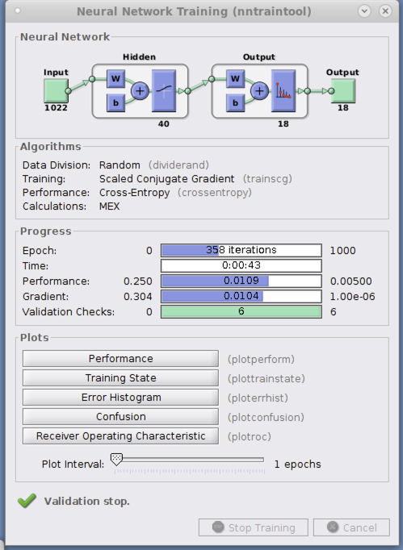

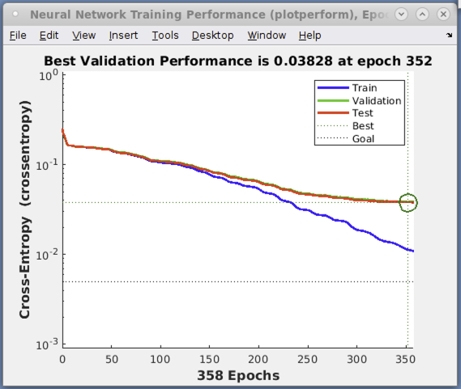


## 10 June

Have tried to use the same parameters configuration for the second diagonal dataset, the implementation for this network reaches similar accuracy as the previous diagonal implementation of around 85%

--------------------------------------------------------------------
    Epoch 258/1000
    63/63 [==============================] - 0s 7ms/step - loss: 0.2752 - accuracy: 0.9074 - val_loss: 0.4992 - val_accuracy: 0.8460
    43/43 [==============================] - 0s 5ms/step - loss: 0.5035 - accuracy: 0.8407
--------------------------------------------------------------------

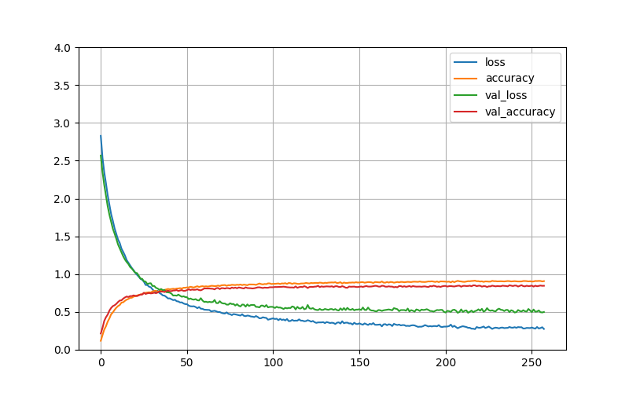


Tried to turn the l2 regularizer on to see how it will affect the training.

### l2 rate = 0.001

--------------------------------------------------------------------
    Epoch 305/1000
    63/63 [==============================] - 0s 8ms/step - loss: 1.1739 - accuracy: 0.8170 - val_loss: 1.1964 - val_accuracy: 0.8054
    43/43 [==============================] - 0s 5ms/step - loss: 1.1895 - accuracy: 0.8037
--------------------------------------------------------------------

The gap between the training and validation has been narrowed down greatly. However, the accuracy was not as good as previous results.

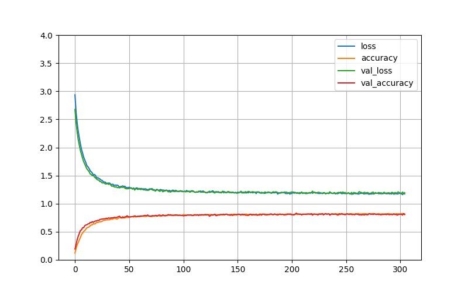


Tried to set the dropout rate to 0.2 to see how it behaves. 

**(dropout 0.2 + l2 0.001)**

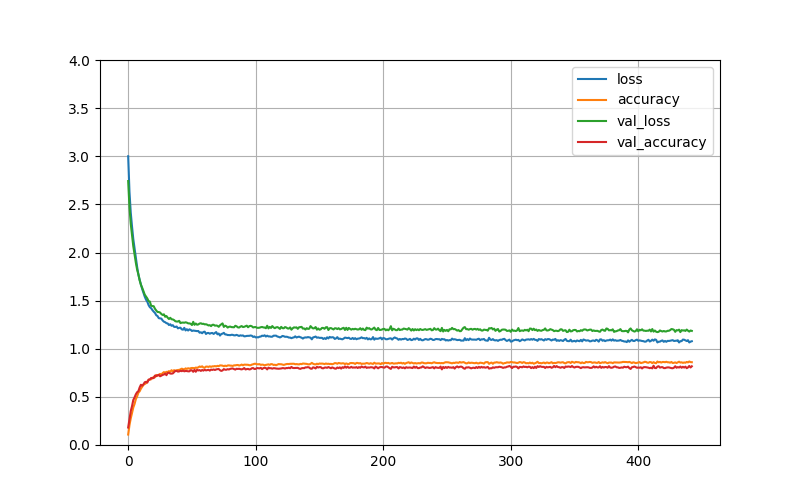

Yet it seems that the l2 regularizer did not help in terms of performance boosting.

--------------------------------------------------------------------
    Epoch 443/1000
    63/63 [==============================] - 0s 8ms/step - loss: 1.0781 - accuracy: 0.8600 - val_loss: 1.1855 - val_accuracy: 0.8177
    43/43 [==============================] - 0s 5ms/step - loss: 1.1854 - accuracy: 0.8044
--------------------------------------------------------------------

**dropout 0.2**

Result without l2 regularizer

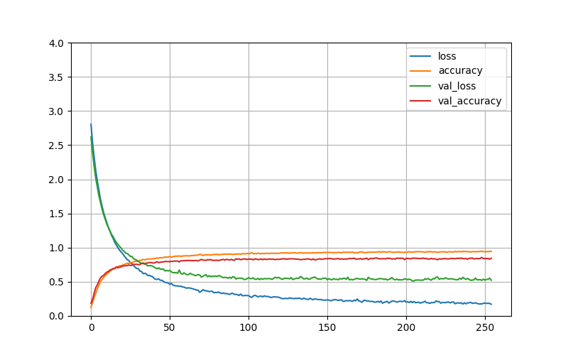

The result shows that dropout rate of 0.2 could not constrain the model as well as the previous rate of 0.25, yet the final validation performance was about the same.

--------------------------------------------------------------------
    Epoch 255/1000
    63/63 [==============================] - 0s 7ms/step - loss: 0.1721 - accuracy: 0.9453 - val_loss: 0.5222 - val_accuracy: 0.8446
    43/43 [==============================] - 0s 8ms/step - loss: 0.5308 - accuracy: 0.8467
--------------------------------------------------------------------

Will keep the dropout rate as 0.25 as before.


**_Think it's time to move on to the ensemble model writing and the final majorvote api research._**


## 13 June

Start writing up for the ensemble model.

Got interrupted by the conference preparation and admin stuff for the conference.


## Resumed on 17 June

Have made a subclassing model for the small ANN since each one has the same structure and model.

```python
class ANN_simple_model(keras.model):
    ...
```

Tried to have a run, but was tossed the error like this:

```Text
Saving the model to HDF5 format requires the model to be a Functional model or a Sequential model. It does not work for subclassed models,
```

This is because the model was not a standard keras model built using Sequantial or Functional API, so older h5 file was not supported on this.

I have changed the way it saves the model by changing it into a path instead of a single file. Everything will be saved in the folder. 

List goes as:

+ assets/  
+ keras_metadata.pb  
+ saved_model.pb  
+ variables/

According to Tensorflow.org:

`The model architecture, and training configuration (including the optimizer, losses, and metrics) are stored in saved_model.pb. 
The weights are saved in the variables/ directory.`

The fianl accuracy is 97.5%, maybe not as good as the one model from matlab, but still good enough.

---------------------------------------------------------------------------
    for i in range(1350):
        bin_count = np.bincount(int_predicted_lb[:,i])
        final_prediction[i] = np.argmax(bin_count)
    diff = correct_lb - final_prediction
    wrong = np.count_nonzero(diff)
    wrong
    Out[15]: 34
    (1350-34)/1350
    Out[16]: 0.9748148148148148
---------------------------------------------------------------------------

This result was accidentally overwritten. But each result of the 20 ANN models were retained as `final_prediction.npy` and `all_20_prediction.npy` 


## 18 June

Trained again, the results were slightly different. However, the overall accuracy was more or less the same, which was 97.2%. with 38 wrongly labelled samples.

This time, the raw results were saved as in `final_raw_prediction.npy`, which contains the softmax results. `final_prediction_18_June.npy` and `all_20_prediction_18_June.npy`

*__The task coming up next should be encapsulation of the original major_vote function. Will have to see if there is any handy API, if not, writing up my own class or function is not 
difficult.__*

(logged down at 01:21 18 June)
